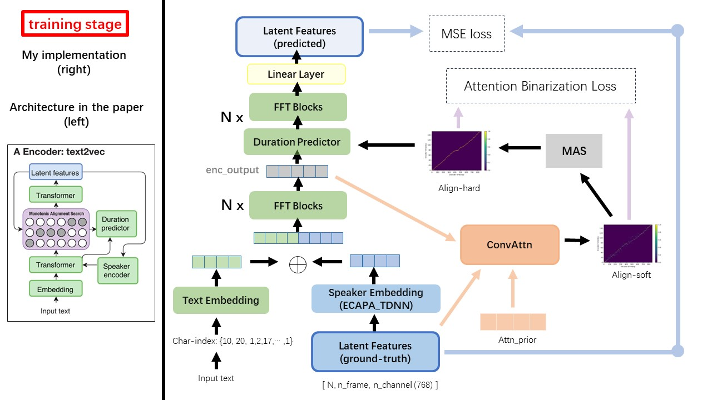
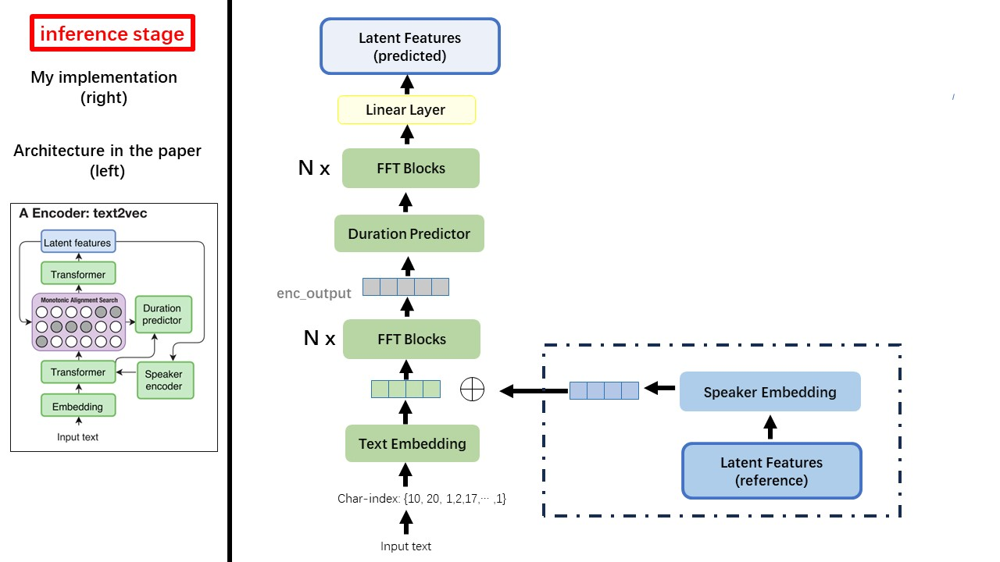
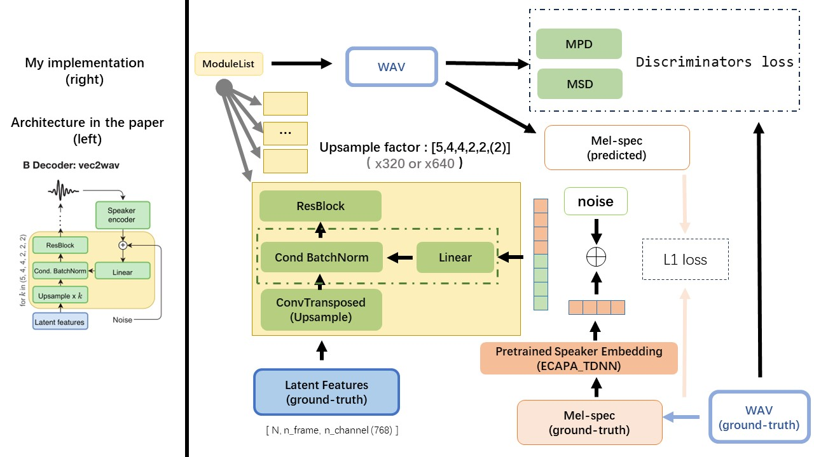

# WavThruVec Pytorch 
An Unofficial Implementation of WavThruVec Based on Pytorch.

The original paper is [WavThruVec: Latent speech representation as intermediate features for
neural speech synthesis](https://arxiv.org/abs/2203.16930)


## architecture 
The Text2Vec model mostly follows the [fastspeech (xcmyz's)](https://github.com/xcmyz/FastSpeech) architecture.
I modified the model, mainly based  on [rad-tts (nvidia's)](https://github.com/NVIDIA/radtts). 
And I add an [ECAPA_TDNN](https://github.com/TaoRuijie/ECAPA-TDNN/tree/main) as speaker encoder, for multi-speaker condition.

For other details not mentioned in the paper, I also follow the rad-tts.

The Vec2Wav is mostly based on the [hifi-gan](https://github.com/jik876/hifi-gan), and introduce Conditional Batch Normalization to condition the network on the speaker embedding. The upsample rates sequence is (5,4,4,2,2) so the upsampling factor is $\times 320$ (original paper is $\times 640$), in other words, the generated WAVs have a sample rate of 16khz (32khz in original paper),.

#### text2vec training


#### text2vec inference


#### vec2wav 



### Input

* for text:

Do not use any rule-based text normalization or phonemization methods, but feed raw character and transform to text-embedding as inputs.

* for audio:

Use [wav2vec 2.0](https://github.com/TencentGameMate/chinese_speech_pretrain)'s output as the wav's feature(instead of mel spectrogram), with a dtype of `'float32'` and a shape of `(batch_size, n_frame, n_channel)`.

note: n_channel=768 or 1024, it depends on which version of the wav2vec 2.0 pretrained model you are using, because TencentGameMate provide fairseq-version(768) and huggingface-version(1024). These two version has different output shape.

### wav2vec 2.0 pretrained

From this repository [wav2vec2.0 (chinese speech pretrain)](https://github.com/TencentGameMate/chinese_speech_pretrain), and it can also be found at [huggingface](https://huggingface.co/TencentGameMate/chinese-wav2vec2-base)

### attn_prior 
One of the biggest difference between WavThruVec and FastSpeech is the monotonic alignment search(MAS) module (refer to the `alignment.py`). 

In FastSpeech, the training inputs include Teacher-Forcing Alignment for mel frames and text tokens. Specifically, it involves using [MFA](https://montreal-forced-aligner.readthedocs.io/en/latest/) to generate the `duration` of mel frames for each text token before training.

While in WavThruVec, the `duration` is generated using the MAS from the rad-tts, and is fed into the LengthRegulator(DurationPredictor).

According to [monotonic alignment search](https://arxiv.org/pdf/2108.10447.pdf) and rad-tts implementation, when you training the model, align-prior files would be generated under `'./data/align_prior'` directory, with the file name format of `{n_token}_{n_feat}_prior.pth`.

## environment
* CUDA 10.1
* python                    3.9.7
* torch                     1.8.1+cu101
* torch-optimizer           0.3.0      
* torchaudio                0.8.1
* tensorboard               2.12.0 
* librosa                   0.8.0 
* numba                     0.56.4
* numpy                     1.22.4  
* llvmlite                  0.39.1  


## dataset and prepare
[aishell3](https://www.aishelltech.com/aishell_3)

The prepare_data.py:
* 1.read the wav files and wav2vec2 pretrained model, resample the wavs to 16khz, and convert to .npy files, which contrain the corresponding wav2vec 2.0 feature.
* 2.read the aishell3 transcription(content.txt), and filter the Chinese phoneme and blank. Take the transcription and file path to build the train list(./data/enc_train.txt).
* 3.build the vocab, which will be used to convert the characters to torch Variable. 

As an example, prepare_data.py only take a few speakers and a few wav files. 


## training
WavThruVec contrains 2 components: Text2Vec(encoder) and Vec2Wav(decoder), and they train independently

Thus, I placed them in two separate dirs and used different training configurations for each.


## TensorBoard
The TensorBoard loggers are stored in the `run/{log_seed}/tb_logs` directory. 
Suppose `log_seed=1`, you can use this command to serve the TensorBoard on your localhost. 


```
tensorboard --logdir run/1/tb_logs
```

## save checkpoint and restore
The model checkpoints are saved in the `run/{log_seed}/model_new` directory.

Suppose you save checkpoints every 10000 iterations, and now you have a checkpoint `checkpoint_10000.pth.tar`.
If you need to restart training at `step 10000`, then use this command.

```
python ./text2vec/train.py --restore_step 10000
```


## Todo

* experiment & Performace 
* More details for implementation 


## Reference
### Repository
- [fastspeech (xcmyz's)](https://github.com/xcmyz/FastSpeech)
- [wav2vec2.0 (chinese speech pretrain)](https://github.com/TencentGameMate/chinese_speech_pretrain)
- [rad-tts (nvidia's)](https://github.com/NVIDIA/radtts)
- [gan-tts (yanggeng1995's)](https://github.com/yanggeng1995/GAN-TTS)
- [hifi-gan](https://github.com/jik876/hifi-gan)
- [Fastpitch (dan-wells')](https://github.com/dan-wells/fastpitch)
- [ecapa_tdnn (Tao Ruijie's)](https://github.com/TaoRuijie/ECAPA-TDNN/tree/main)
- [ecapa_tdnn (lawlict's)](https://github.com/lawlict/ECAPA-TDNN/tree/master)
- [glow-tts (jaywalnut310's)](https://github.com/jaywalnut310/glow-tts)

### Paper
- [FastSpeech](https://arxiv.org/abs/1905.09263)
- [FastSpeech2](https://arxiv.org/abs/2006.04558)
- [hifi-gan](https://arxiv.org/pdf/2010.05646.pdf)
- [wav2vec](https://arxiv.org/pdf/2006.11477.pdf)
- [rad-tts](https://openreview.net/pdf?id=0NQwnnwAORi)
- [monotonic alignment search](https://arxiv.org/pdf/2108.10447.pdf)
